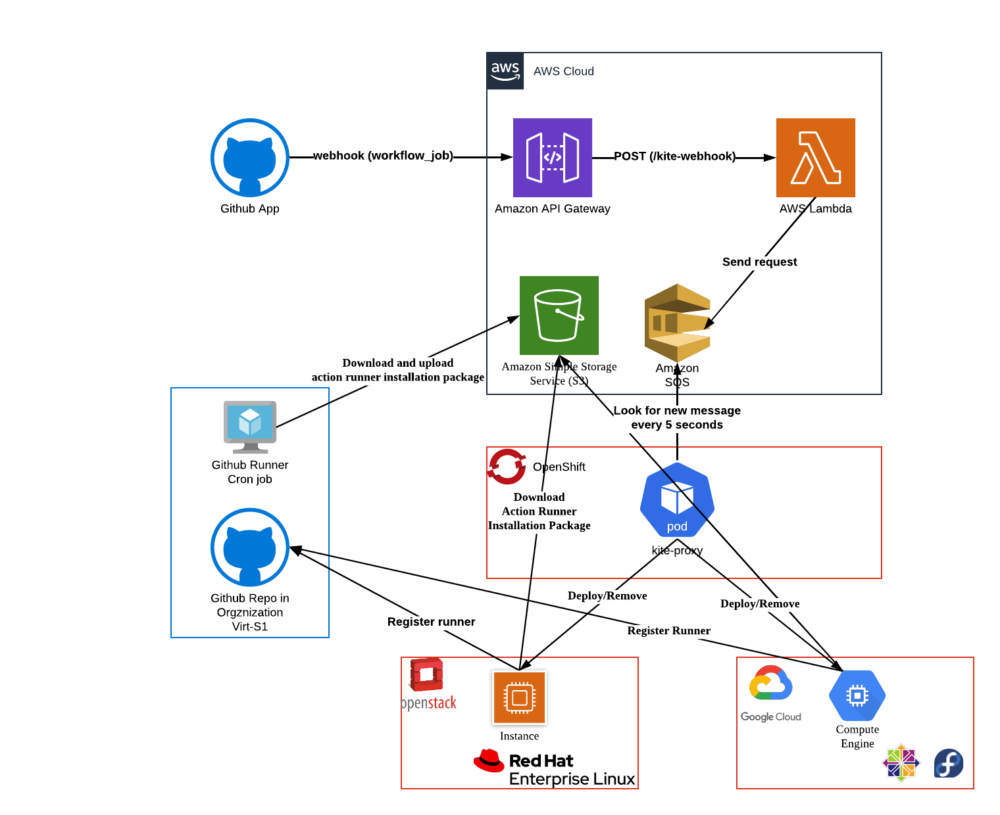

# kite-action v2

**kite CI and self-hosted runner auto-scaling**

## Github self-hosted action runner auto-scaling diagram

## CI use case

### [osbuild-composer](https://github.com/osbuild/osbuild-composer)

[self-hosted runner code](https://github.com/virt-s1/kite-action/tree/composer_ci)

### [rhel-edge](https://github.com/virt-s1/rhel-edge)

[self-hosted runner code](https://github.com/virt-s1/kite-action/tree/rhel-edge)

### [dev](https://github.com/virt-s1/kite-demo)

[self-hosted runner code](https://github.com/virt-s1/kite-action/tree/dev)

## Tips

### How to create secret

    $ oc create secret generic openstack-cerdential --from-file=clouds.yaml=~/.config/openstack/clouds.yaml
    $ oc create secret generic gcp-sa-file --from-file=gcp_service_account.json=gcp_service_account.json
